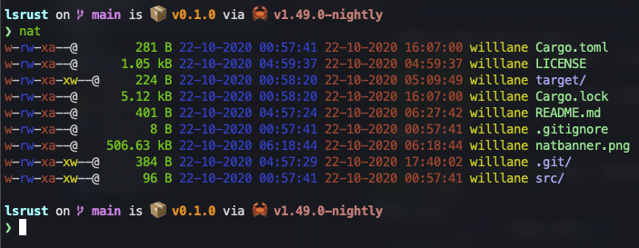

# ⚡️ nat ⚡️

[What is nat?](https://github.com/willdoescode/nat#what-is-nat)

[Highlights](https://github.com/willdoescode/nat#highlights)

[Installation](https://github.com/willdoescode/nat#installation)

[Understanding permissions output](https://github.com/willdoescode/nat#understanding-permissions-output)




## What is nat?

Nat is a complete replacement for the 'ls' command

Nats features include

- Showing file permissions
- Showing file size
- Showing the date that the file was modified last
- Showing the user that the file belongs to 
- Showing the group that the file belongs to
- An easy to use file search
- A splash of color to distinguish between files and folders


## Join the nat [discord server](https://discord.gg/2Fn8veP)


## Highlights

- A rather large german tech blog wrote an [article](https://www.heise.de/news/In-Rust-geschrieben-und-uebersichtlicher-nat-will-ls-ersetzen-4937429.html) about nat

## Usage

### Installation 

```bash
cargo install natls
```

### Manual installation

```bash
apt-get install rustc cargo
cd /tmp

git clone https://github.com/willdoescode/nat.git
cd /tmp/nat

cargo build --release

cd target/release

./nat
```

To install nat locally
```bash
cd /tmp/nat
cargo install --path .
```
and add this line to your `$HOME/.bashrc`

```bash
export PATH=$PATH:$HOME/.cargo/bin
```

### On Arch Linux
```bash
yay -S nat-git
```

#### Using nat with ls

in zshrc or bashrc
```bash
alias ls='natls'
```

### Running

```bash
natls <dir>
```

#### Searching for file

```bash
natls <dir (leave empty if in wanted dir)> -f <file>
```

### To edit the code

```bash
git clone https://github.com/willdoescode/nat.git
cd nat
```

## Uninstall steps

```bash
cargo uninstall natls
```

## Understanding permissions output

Imagine file permissions as three ones or zeros

```
000 no access
100 read
010 write
001 execute
101 read and execute
110 read and write
011 write and execute
111 read write and execute
```

what nat does is it combines these permissions for

user-group-other

so if the user has read write and execute and the group has read and write and other has no perms the output will look like

```
rwxrw----
```

If all groups have read write and execute the output would look like

```
rwxrwxrwx
```
