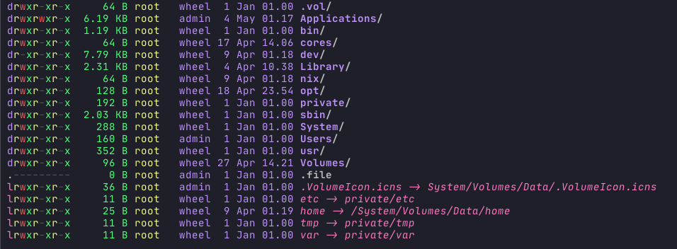

[](https://deps.rs/crate/natls/2.1.14) [](https://snapcraft.io/natls)

# 🎨 Natls 🎨



### Why Natls?

- Showing file permissions
- Showing file size
- Showing the date that the file was modified last
- Showing the user that the file belongs to 
- Showing the group that the file belongs to
- An easy to use file search
- A splash of color to distinguish between files and folders and other file types

### Installation 

```bash
# Through Cargo
cargo install natls

# Through Homebrew
brew install willdoescode/natls/natls

# Through SnapCraft
sudo snap install natls
```

### Usage

```bash
natls <flags> <dir>
```

### Understanding permissions output

```
000 no access
100 read
010 write
001 execute
101 read and execute
110 read and write
011 write and execute
111 read write and execute
```

Format: user-group-other

User: Read, Write, and Execute

```
rwxrw----
```

All Groups: Read, Write, and Execute

```
rwxrwxrwx
```

> :warning: **Natls** is not supported on Windows
